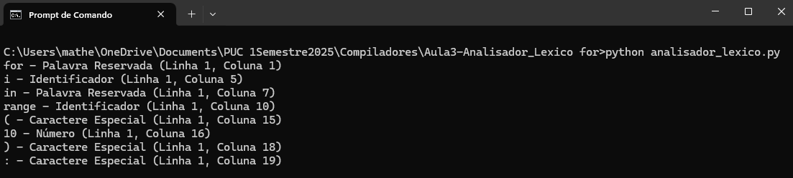

# Analisador Léxico
### Exercício prático da Aula 3 de Linguagens Formais e Compiladores

#### Aluno: Matheus Paul Lopuch

#### Objetivo:
> Seu trabalho será criar um analisador léxico, usando apenas
> máquinas de estado finito capaz de validar todos os lexemas
> necessários para a redação de um laço de repetição 𝒇𝒐𝒓 em
> Python. Observe que seu esforço é limitado ao laço 𝒇𝒐𝒓.
> 
> O código não precisa rodar, mas a saída do seu programa precisa
> ser um string contendo todos os tokens correspondentes a esse
> laço na ordem correta. Se for usar o Python use como estrutura
> de dados, uma lista de objetos, cada objeto com
> valor, posição na linha e classe. Cabe a você definir o alfabeto necessário para
> a representação da linguagem deste laço.

Como funciona:
- Ignora espaços e quebras de linha: Incrementa linha/coluna mas não gera tokens.
- Identificar palavras reservadas e identificadores: Começa com letra ou underscore e continua com letras, números ou underscore.
- Identificar números: Sequências de dígitos.
- Identificar caracteres especiais: Símbolos como parênteses, dois-pontos, etc.

Cada token contém:
- valor: A string do token
- classe: O tipo do token (Palavra Reservada, Identificador, etc.)
- linha e coluna: Posição no código

Como compilar e executar:
```bash
  python analisador_lexico.py
```

Exemplo de execução:


